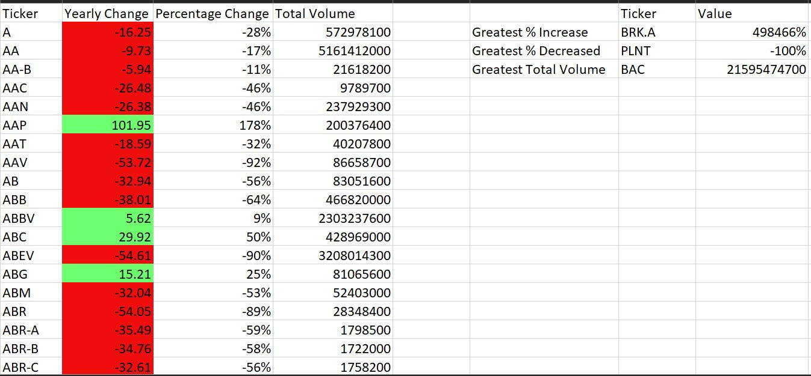
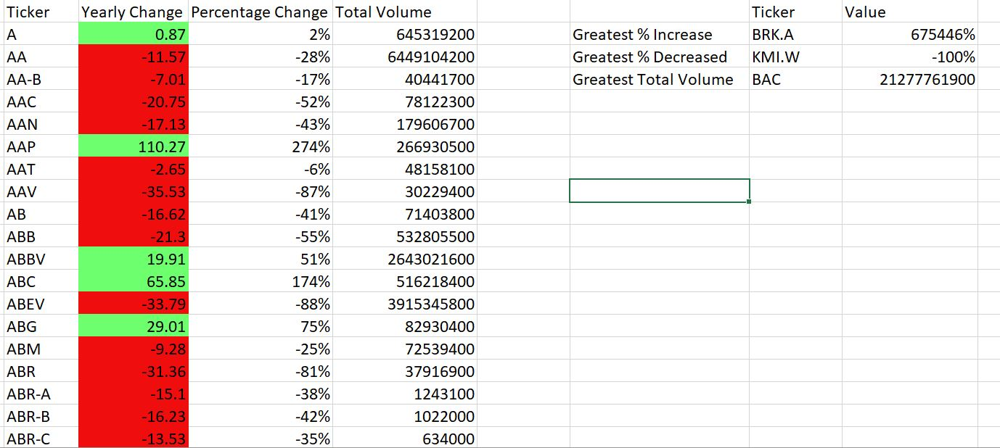

<h3>VBA Scripting: Stock Market Analysis</h3>

<h4>Created a script to loop through all the stocks for one year and obtained the output for:</h4>
<ul>
  <li>Ticker Symbol</li>
  <li>Percentage and Yearly change from opening price at the beginning of a year to the closing price at the end of the year</li>
  <li>The total stock volume of the stock/li>
  <li>Put in place conditional formatting to highlight posisitve change in green and negative in red</li>
</ul>

Full scripts can be explored <a href="https://github.com/foofx88/VBA-Scripting-Stock-Market-Analysis/blob/main/Multiple_year_stock.vbs">here</a>

<h4>Screenshots to show the the different results for each sheet (Year)</h4>

2014

2015

2016

